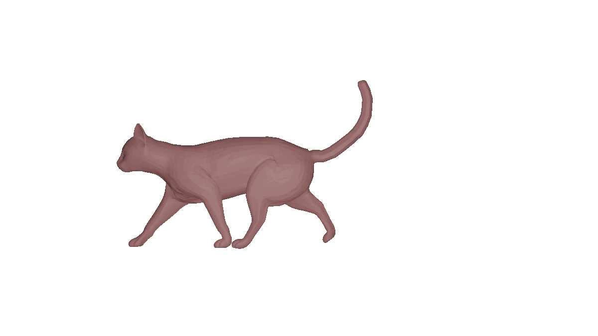

H2_SurfaceMatch
=========

<table>
<tr>
<td></td><td></td><td></td>
</tr>
<tr>
<td></td><td></td><td></td>
</tr>

</table>

Description
-----------

This Python package provides a set of tools for the comparison, matching and interpolation of triangulated surfaces within the elastic shape analysis setting. It allows specifically to solve the geodesic matching and distance computation problem between two surfaces with respect to a second order Sobolev metric. In addition to basic shape matching, we develop a comprehensive statistical pipeline that allows for the computation of the Karcher means, tangent space principal component analysis, and motion transfer in the space of parametrized surfaces and in shape space. Thus, our framework is equipped to handle statistical analysis of populations of shapes. Further to improve the robustness of our model, we implement a weighted varifold matching framework for partial matching. By implementing partiality in our methods we allow for the analysis of shape populations that a include surfaces that are noisy or are missing data. Further, this adaptation allows for a more natural comparison of shapes with different mesh structures and even allows for the comparison of shapes with different topologies.

References
------------
    @article{hartman2022elastic,
    author = {Hartman, Emmanuel and Sukurdeep, Yashil and Klassen, Eric and Charon, Nicolas and Bauer, Martin},
    year = {2023},
    month = {01},
    pages = {},
    title = {{Elastic Shape Analysis of Surfaces with Second-Order Sobolev Metrics: A Comprehensive Numerical Framework}},
    volume = {131},
    journal = {International Journal of Computer Vision},
    doi = {10.1007/s11263-022-01743-0}
    }

Please cite [this paper](https://link.springer.com/article/10.1007/s11263-022-01743-0) in your work.

Usage
-----------
Several scripts that demonstrate the usage of our main functions have been included in the demos folder. 

Dependencies
------------

H2Surface_Match is entirely written in Python while taking advantage of parallel computing on GPUs through CUDA. 
For that reason, it must be used on a machine equipped with an NVIDIA graphics card with recent CUDA drivers installed.
The code involves in addition the following Python libraries:

* Numpy (1.19.2) and Scipy (1.6.2)
* Pytorch (1.13.1)
* PyKeops (2.1.1) (https://www.kernel-operations.io/keops/index.html)
* Open3D (0.12.0)

Note that Open3d is primarily used for surface reading, saving, visualization and simple mesh processing operations (decimation, subdivision...). Other libraries such as PyMesh could be used as potential replacement with relatively small modifications to our code.  

Licence
-------

This program is free software: you can redistribute it and/or modify it under 
the terms of the GNU General Public License as published by the Free Software 
Foundation, either version 3 of the License, or (at your option) any later 
version.

This program is distributed in the hope that it will be useful, but WITHOUT 
ANY WARRANTY; without even the implied warranty of MERCHANTABILITY or FITNESS 
FOR A PARTICULAR PURPOSE. See the GNU General Public License for more details.

You should have received a copy of the GNU General Public License along with 
this program. If not, see http://www.gnu.org/licenses/.

Contacts
--------
    Emmanuel Hartman: ehartman(at)math.fsu.edu

    Martin Bauer:     bauer(at)math.fsu.edu

    Yashil Sukurdeep: yashil.sukurdeep(at)jhu.edu

    Nicolas Charon:   ncharon1(at)jhu.edu

